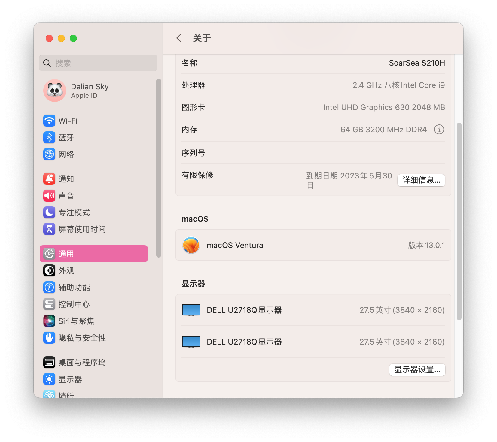

# SoarSea-S210H-Hackintosh

     

## 电脑配置

|     规格      |                           详细信息                           |
| :-----------: | :----------------------------------------------------------: |
|   电脑型号    |                        SoarSea S210H                         |
|   操作系统    | macOS `Ventura` /  `Monterey` / `Big Sur` / `Catalina` / `Mojave` |
|    处理器     |               英特尔 酷睿 i9-10980HK / i9-10885H /i9-9980HK 8核16线程 i7-10870H 8核16线程 i7-10750H 6核12线程               |
|     内存      |                      64 GB DDR4 3200MHz                      |
|    硬盘1/2    | WD SN570 1TB/HS-SSD-C2000 2TB 支持双NVMe或NVMe+SATA SSD或双SATA SSD |
|    硬盘/3     |                 可接SATA 2.5寸硬盘/SSD(7mm)                  |
|     显卡      |                    Intel UHD Graphics 630                    |
|   视频输出    | DP 1.2 x 1 (Support 4K@60Hz) HDMI 2.0a x1 (Support 4K@60Hz) |
|     声卡      |        Cmedia HS-100B **USB Audio Device** `alcid=11`        |
|   无线网卡    | m.2 NGFF插槽，已更换为[BCM94360Z3](https://blog.daliansky.net/uploads/WeChatandShop.png) |
|   有线网卡1   | **Realtek RTL8125B PCI Express 2.5 Gigabit Ethernet**(i9) **Realtek RTL8168H/8111H PCI Express Gigabit Ethernet**(i7) |
|   有线网卡2   |         **Intel I219 PCI Express Gigabit Ethernet**          |
| 体积尺寸/重量 |                 143mm x 136mm x 64mm / 1050g                 |
|     电源      |                19V x 4.73A 90W 5.5mm x 2.5mm                 |

## 更新日志

- 3-15-2023
  - Release `v1.2.0`
  - 更新 `OpenCore` `v0.9.0`
  
- 2-15-2023
  - Release `v1.1.0`
  - 更新 `OpenCore` `v0.8.9`
- 11-25-2022
  - Release `v1.0.0`
  - 更新 `OpenCore` `v0.8.6`
  - 初始版本

## 截屏

